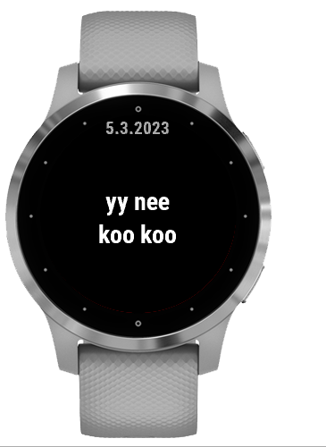

# kaa-kaa-kaa-kaa

In Finland we can count 1, 2, 3, 4... "yksi, kaksi, kolme, neljä", but also "yks, kaks, kol, nel" 
...but also "yy, kaa, koo, nee". 

Here's a different way to show the time.

For Garmin Vivoactive 4S

